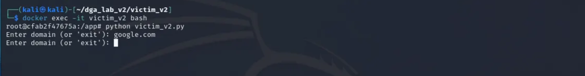

# Domain Generation Algorithms (DGA) - Simulation and Detection using ML in a Dockerized Lab Environment


**Objective:**

- To understand how DGA works in malware communication.
- To replicate victim queries to DGA domains.
- To implement basic detection and visualization using Python, ML, and Flask.

---

## **Introduction / Background**

- **Domain Generation Algorithms (DGAs):** Malware often uses DGAs to create large numbers of random-looking domains, making it hard for defenders to block Command-and-Control (C2) servers.
- **Why Lab Simulation:** Building a controlled lab allows safe, isolated study of DGA behavior, testing of detection techniques, and hands-on learning without real-world risk.

## **Docker Containers:**

| Container | Role | Main functions | Base Image |
| --- | --- | --- | --- |
| **Victim** | Endpoint simulator | - DGA generator + terminal prompt for user queries- For each domain: send it to Defender for validation, wait for verdict- If verdict = **Not DGA**, attempt connection to that domain; if verdict = **DGA**, block- Logs everything (queries, verdicts, actions) to host via volume | python:3.11-slim |
| **Defender** | ML-based SOC & dashboard | - Receives domain-check requests from Victim- Uses a scikit-learn **Decision Tree** classifier + simple rules & a manual block/unblock list to decide **DGA / Not DGA**- Returns verdict to Victim; dashboard can manually override- Logs features, predictions, overrides to host; web dashboard shows real-time queries & allows manual block/unblock | python:3.11-slim |
| **Attacker** | DGA origin / (simulated) C2 | - Generates DGA domains (internal list) and runs a simple HTTP server to accept connections- On incoming connection: if requested domain == one of the **three allowed domains** (`google.com` / `microsoft.com` / `facebook.com`) → reply `hi from <domain>`; if domain is non-DGA but not one of those → drop / ignore- If domain *is* a DGA domain and the Defender mistakenly flagged it as Not-DGA (or a human manually unblocked it) → accept and reply `C2 server connected` (simulate C2)- Logs all connection attempts to host | python:3.11-slim |

---

## **Lab Workflow**

1. Victim periodically generates sets of DGA domains (10 domains per set, repeating) and also accepts user-entered domain queries.
2. Each generated or user-entered domain is sent from the Victim to the Defender for validation.
3. Defender extracts numeric features from the domain (length, digits, letters, unique chars, vowels, consonants, digit ratio, entropy) and runs a Decision Tree ML model.
4. Defender returns a verdict for each domain: **DGA**, **NOT_DGA**, or **UNKNOWN** (fallback/error).
5. Defender logs every query, the extracted features, model output/confidence, and any manual overrides; the dashboard displays queries in real time.
6. Manual block/unblock actions performed via the Defender dashboard override the model decision and are persisted.
7. Victim waits for Defender’s verdict before taking action on each domain.
8. If verdict = **DGA**, Victim blocks the domain and records the block in its logs.
9. If verdict = **NOT_DGA**, Victim attempts to connect to the domain (simulation via Host header or DNS proxy).
10. Attacker runs a rotating DGA backend that produces sets of labels and marks a random subset as active C2 endpoints.
11. On incoming connection attempts, Attacker inspects the requested domain:
    - replies “hi from <domain>” for the three allowed benign domains (google.com, microsoft.com, facebook.com).
    - replies “C2 server connected” for active attacker DGA domains that were mistakenly allowed (false negative or manual unblock).
    - drops or ignores all other requests.
12. Attacker logs all incoming requests, decisions (accepted/dropped), and responses.
13. All containers persist logs to host-mounted folders so queries, decisions, and connection history are retained for analysis.
14. The overall loop demonstrates detection, prevention, analyst override, and the impact of false negatives (attacker C2 access).

---

## **Implementation Steps (Step-by-Step)**

1. Install Docker on host VM
    
    Updating of host:
    
    ```bash
    sudo apt update
    ```
    
    Installing docker:
    
    ```bash
    sudo apt install docker.io
    ```
    
    ```bash
    sudo systemctl enable docker --now
    ```
    
    Adding Your User to Docker Group:
    
    ```bash
    sudo usermod -aG docker $USER
    newgrp docker
    ```
    
    Install docker-compose:
    
    ```bash
    sudo apt install docker-compose
    ```
    
2. Folder and file allocation
    
    Download and allocate the files in this order:
    
    ```bash
    dga_lab_v2
    ├── docker-compose.yml
    ├── attacker_v2
    │   ├── attacker_v2.py
    │   ├── Dockerfile
    │   └── logs # this folder will be automatically generated with its files
    │       └── attacker_v2.log
    ├── defender_v2
    │   ├── datasets
    │   │   └── domains_features_numeric_with_more_tables.csv
    │   ├── defender_v2.py
    │   ├── Dockerfile
    │   ├── logs # this folder will be automatically generated with its files
    │   │   ├── blocked.json
    │   │   ├── defender_v2.log
    │   │   └── queries.json
    │   └── static
    │       └── bg.png 
    └── victim_v2
        ├── Dockerfile
        ├── logs # this folder be will automatically generated with its files
        │   └── victim_v2.log
        └── victim_v2.py
    ```
    
3. Build and start everything (single command)
    
    From project root:
    
    ```bash
    cd ~/dga_lab_v2
    
    docker-compose up --build -d #use --build only for first time
    ```
    
    - `-build` forces rebuild (useful after changing Dockerfiles).
    - `d` runs detached.
    
    **Wait** for the build to finish — the first build may take a few minutes (pip installs etc).
    
    
    
4. Verify containers are Up
    
    Run:
    
    ```bash
    docker ps --filter "name=attacker_v2" --filter "name=victim_v2" --filter "name=defender_v2"
    ```
    
    You should see three containers with `Up` status and ports `5000` (defender) and `8080` (attacker) published.
    
    
    
5. Basic health checks (quick tests)
    
    From host (VM):
    
    ```bash
    curl http://localhost:5000/health      # defender
    curl http://localhost:8080/health      # attacker
    ```
    
    Expect JSON responses:
    
    - Defender: `{"status":"ok","model_loaded":<true|false>}`
    - Attacker: `{"status":"ok","active_sample":[...],"labels_count":10}`
    
    If any fail, check logs (step 6).
    
6. Tail logs to observe startup behavior (recommended)
    
    Open 2 terminals or run in background:
    
    ```bash
    docker compose logs -f defender_v2
    docker-compose logs -f attacker_v2
    ```
    
    Look for:
    
    - Defender: "Model trained successfully." or fallback message if CSV missing.
    - Attacker: periodic lines like `New DGA set #...` and active C2 labels.
    
    
    
    If you see errors (import error, missing module), rebuild or install packages as described in Dockerfiles.
    
    - Open your browser and type this URL to view SOC Dashboard.
    
    ```bash
    http://localhost:500
    ```
    
7. Run Victim interactively
    
    To use the victim’s interactive terminal (type domains):
    
    ```bash
    cd attacker_v2
    docker exec -it victim_v2 bash
    # inside container shell:
    python victim_v2.py
    ```
    
    - You’ll see DGA sets generated in the background and a prompt to type domains.
    - Type `google.com` or `facebook.com` to test allowed domains.
    - Type `exit` to stop.
    
    
    
8. Demonstrate false-negative (manual-unblock) scenario
    - Identify an **attacker active label** from attacker logs (copy a label from `attacker_v2` logs).
    - If Defender classifies it `DGA`, go to the dashboard and **Unblock** that domain manually.
    
    
    
    - Resend the domain from Victim (type domain) — Defender will return `NOT_DGA` (manual override) and Victim will attempt connection.
    - If attacker currently has that label as **active C2**, attacker will reply `"C2 server connected"` — this demonstrates the false-negative consequence.
9. How to update code & redeploy safely
    
    **When you edit Python files on host (`~/dga_lab_v2/...`), because they are mounted into containers, the containers will see file changes immediately.**
    
    If you changed the Dockerfile (added packages), rebuild the affected service:
    
    ```bash
    # rebuild and restart defender only
    docker compose up --build -d defender_v2
    # or rebuild all
    docker-compose up --build -d
    ```
    
10. Stopping the lab
    
    To stop all containers:
    
    ```bash
    # make sure u r in ~/dga_lab_v2
    docker-compose down
    
    docker ps # to review
    ```
    

---


## **Conclusion**

- DGAs generate many pseudo-random domains to hide and maintain malicious infrastructure.
- Malware communication can be safely simulated using local containers, HTTP stubs, and controlled datasets.
- DGA detection is achievable with simple feature extraction (length, entropy, digit ratio, etc.), rule-based checks, and lightweight ML models like decision trees.

---

## dga_lab_v3

- Enhances SOC dashboard.
- DNS proxy.
- ML will train with large data set with more features.
